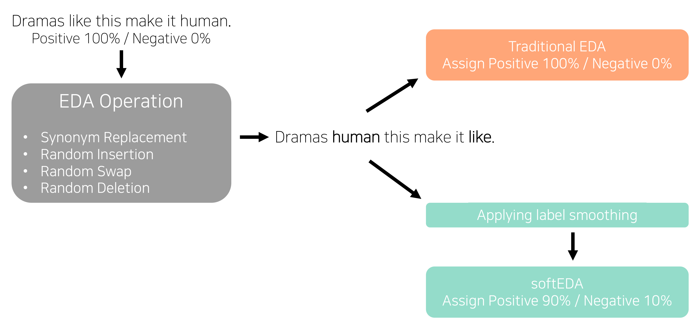

# SoftEDA: Rethinking Rule-Based Data Augmentation with Soft Labels

## Introduction

softEDA is a variant of [EDA (Easy Data Augmentation) (EMNLP 2019)](https://aclanthology.org/D19-1670/). softEDA introduces soft label on augmented data by applying label smoothing.
The figure below shows the structure of softEDA compared to traditional EDA. For more information, please refer to the [paper](https://openreview.net/forum?id=OiSbJbVWBJT)!




## Install requirements

```shell
pip install -r requirements.txt
```

## Run

```shell
# Check utils/arguments.py and modify path arguments
python total_search.py
```

## Citation

If you found this work helpful for your future research, please consider citing this work:

```
@inproceedings{choi2023softeda,
  title={SoftEDA: Rethinking Rule-Based Data Augmentation with Soft Labels},
  author={Choi, Juhwan and Jin, Kyohoon and Lee, Junho and Song, Sangmin and Kim, YoungBin},
  booktitle={ICLR 2023 Tiny Papers},
  year={2023}
}
```
